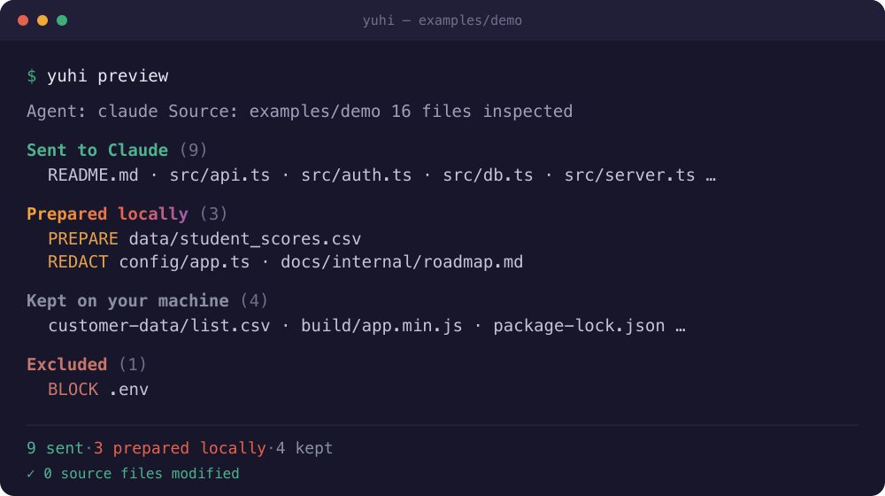

# Yuhi

> **Yuhi prepares the right context before an AI starts. Everything else is an extension.**

**What is Yuhi?** A local-first developer tool that decides — per file — what to
**send** to your AI agent, what to **prepare locally** first, and what to **keep** on
your machine. Your agent (Claude Code, and more) gets exactly the context it needs,
and nothing it shouldn't. Your original files are never modified.

```bash
yuhi preview      # what your AI will receive
yuhi run claude   # launch the agent on the prepared context
```

> 🌐 Also in [日本語](./README.ja.md) · [简体中文](./README.zh-CN.md)

<!-- Static preview of `yuhi preview`. For an animated GIF, run `vhs docs/demo.tape` (see docs/DEMO.md). -->


```text
git status   →  shows what changed
yuhi status  →  shows what your AI knows
```

Every file takes one route:

```console
$ yuhi preview

Sent to Claude
  README.md
  src/
Prepared locally
  student_scores.csv
Runtime only
  .env
Keep local
  customer-data/
```

And **Prepare locally** actually runs — on your machine, before anything is sent:

```text
student_scores.csv

  Original           Tanaka Aoi · S-10241 · 42 · 3-B
        │  prepared locally  (pseudonymize → safety check)
        ▼
  Claude receives    Subject-B412F3 · 42 · 3-B
```

The five routes are the whole vocabulary: **Sent to Claude · Prepare locally · Remove
secrets · Runtime only · Keep local**. That's it.

> **Coming soon:** Prepare locally with a local AI model.

---

## Why

You launch an AI agent inside your working tree and it can read everything there —
`.env` files, cloud credentials, customer data, private specs. Yuhi lets you **see
and shape that context before the agent starts**, then runs the agent on a clean copy.

- **Preview first.** `yuhi preview` shows every file the agent will and won't see.
- **Explain everything.** `yuhi explain path/to/file` tells you which rule matched and why.
- **Your repo is never touched.** Yuhi copies into `~/.yuhi/workspaces/<id>`; the original is read-only to it.
- **Keep secrets and private data out** of the context — or redact them in the copy.
- **Same policy** from the CLI and the VS Code extension — one vocabulary everywhere.
- **No telemetry**, no account, works offline. Apache-2.0 licensed.

## Quickstart (≈ 2 minutes)

```bash
# In your project (Node.js 20+):
npx @yuhi-ai-labs/yuhi init        # writes yuhi.yaml (respects .gitignore etc.)
npx @yuhi-ai-labs/yuhi preview     # see what an agent would see
npx @yuhi-ai-labs/yuhi run dummy   # try the whole flow offline with a bundled stand-in agent
npx @yuhi-ai-labs/yuhi run claude  # launch Claude Code in the generated context
```

> The npm package is **`@yuhi-ai-labs/yuhi`**. The current release is a **beta** dist-tag —
> pin it with `npx @yuhi-ai-labs/yuhi@beta preview`. To build from source instead:
> `pnpm install && pnpm build`, then `node apps/cli/dist/index.js`.

Example `yuhi preview` output:

```
Yuhi Preview

Agent: claude
Source: /path/to/examples/demo
16 files inspected

Sent to Claude  (9)
  ALLOW                README.md
  ALLOW                src/api.ts
  ALLOW                src/auth.ts
  …

Prepared locally  (3)
  PREPARE              data/student_scores.csv
  REDACT               config/app.ts
  REDACT               docs/internal/roadmap.md

Kept on your machine  (4)
  LOCAL-ONLY           customer-data/list.csv
  LOCAL-ONLY           build/app.min.js
  …

Excluded  (1)
  BLOCK                .env

Summary
  9 sent to claude        original files, unchanged
  3 prepared locally      transformed before sending
  4 kept on your machine  never sent to the AI
  ✓ 0 source files modified
```

## The policy: `yuhi.yaml`

A small, declarative file (validated by `schemas/yuhi.schema.json` — editor
autocomplete works out of the box):

```yaml
version: "1"
defaults:
  action: allow
rules:
  - name: block-env
    match:
      paths: ["**/.env", "**/.env.*", "!**/.env.example"]
    action: block
  - name: redact-secrets
    match:
      detectors: [api-key, access-token, private-key]
    action: redact
  - name: keep-customer-data-local
    match:
      paths: ["customer-data/**"]
    action: local-only
```

Actions map to the routes above: `allow` (Send directly), `redact` (Remove secrets),
`prepare-locally` (Prepare locally), `inject` (Runtime only), `local-only` (Keep
local), `block` (Exclude), plus `ask`. Local-model routes (`summarize-local`,
`metadata-only`) are planned for **v1.1**. When multiple rules match, **the most
restrictive wins**, and any detected secret escalates a file to at least `redact`.

## Commands

| Command | What it does |
|---|---|
| `yuhi init` | Create `yuhi.yaml` (honors `.gitignore`, `.dockerignore`, …) |
| `yuhi status` | The AI context at a glance — like `git status` |
| `yuhi preview` | **The signature command** — what the agent will see |
| `yuhi diff` | What changed in the context since the last run |
| `yuhi explain <path>` | Why a file is allowed / blocked / redacted / local-only |
| `yuhi scan` | Local inspection: secrets & sensitive files (never prints values) |
| `yuhi run <agent> [-- …]` | Generate the context and launch the agent (`--` forwards args) |
| `yuhi doctor` | Check your environment & config |

`--json`, `--quiet`, `--no-color`, and `--lang en|ja|zh-CN` are supported everywhere.
Advanced: `yuhi workspace list/inspect/clean` and `yuhi audit list/show/export`.

## ⚠️ What Yuhi is — and is not

Yuhi is **defense-in-depth for AI context, not a sandbox.** It controls the *inputs*
an agent starts from. It does **not**:

- intercept or block the agent's network traffic (whatever the agent sends to its model provider is outside Yuhi's control);
- confine the agent's filesystem at the OS level (a determined agent process can still open absolute paths or walk `..`);
- guarantee zero data leakage.

We deliberately avoid claims like "100% secure" or "guaranteed no leakage." See
[`docs/THREAT_MODEL.md`](./docs/THREAT_MODEL.md) for the full model and roadmap toward optional
sandbox backends (Docker, `sandbox-exec`, bubblewrap, Windows Sandbox).

## Feature status

| Area | Status |
|---|---|
| `init` / `scan` / `preview` / `explain` / `status` / `diff` | **Stable** |
| Secure workspace generation + redaction | **Stable** |
| Prepare locally (pseudonymize + safety check) | **Stable** |
| Runtime-only env injection | **Stable** |
| Policy engine (globs, precedence, detectors) | **Stable** |
| `dummy` agent (offline) + Claude Code adapter | **Stable** |
| Local audit log | **Stable** |
| VS Code extension (preview, badges, status, run) | **Beta** — on the VS Code Marketplace |
| Codex / Gemini adapters | Planned |
| Local-model routes (`summarize-local`, `metadata-only`) | Planned — **v1.1** |
| OS sandbox backends | Not implemented (design in `docs/THREAT_MODEL.md`) |

## Architecture

A pnpm + TypeScript monorepo. The core is UI-agnostic (no VS Code dependency):

```
packages/  shared · config · policy · scanner · processors · workspace · agents · audit · core
apps/      cli · vscode
```

See [`docs/ARCHITECTURE.md`](./docs/ARCHITECTURE.md) and `docs/adr/`.

## Project direction

- [`docs/ROADMAP.md`](./docs/ROADMAP.md) — done / in progress / next / future.
- [`docs/THREAT_MODEL.md`](./docs/THREAT_MODEL.md) — what Yuhi does and does **not** protect against.
- [`docs/ARCHITECTURE.md`](./docs/ARCHITECTURE.md) — how the codebase is structured.

## Contributing

Issues and PRs welcome — see [`CONTRIBUTING.md`](./CONTRIBUTING.md) and
[`CODE_OF_CONDUCT.md`](./CODE_OF_CONDUCT.md). Adding an agent is often just a config
entry; adding a secret detector is a small, testable change.

## License

[Apache-2.0](./LICENSE) — © Yuhi contributors. No telemetry. Local-first. Vendor-neutral.
